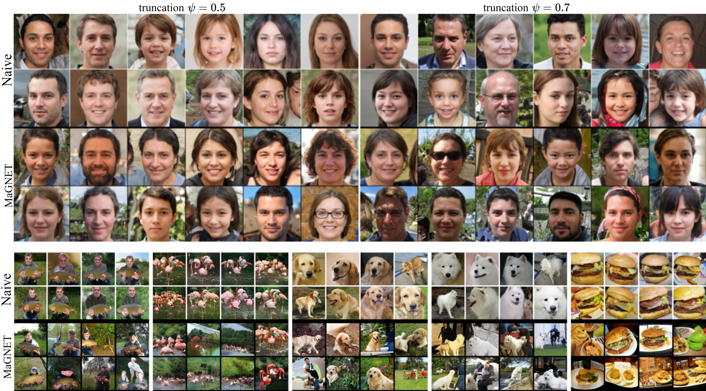

## MaGNET: Uniform Sampling from Deep Generative Network Manifolds Without Retraining, _ICLR 2022_
[](https://paperswithcode.com/sota/image-generation-on-ffhq?p=magnet-uniform-sampling-from-deep-generative-1)
[](https://colab.research.google.com/drive/1r6QX8jYe1tsQmZFO4myw3O29nqcKfdx5?usp=sharing)


Fig: Uncurated images generated via Naive and MaGNET sampling on StyleGAN2-FFHQ and BigGAN-ImageNet

Paper Link: https://arxiv.org/abs/2110.08009

Abstract: _Deep Generative Networks (DGNs) are extensively employed in Generative Adversarial Networks (GANs), Variational Autoencoders (VAEs), and their variants to approximate the data manifold and distribution. However, training samples are often distributed in a non-uniform fashion on the manifold, due to costs or convenience of collection. For example, the CelebA dataset contains a large fraction of smiling faces. These inconsistencies will be reproduced when sampling from the trained DGN, which is not always preferred, e.g., for fairness or data augmentation. In response, we develop MaGNET, a novel and theoretically motivated latent space sampler for any pre-trained DGN, that produces samples uniformly distributed on the learned manifold. We perform a range of experiments on various datasets and DGNs, e.g., for the state-of-the-art StyleGAN2 trained on FFHQ dataset, uniform sampling via MaGNET increases distribution precision and recall by 4.1% & 3.0% and decreases gender bias by 41.2%, without requiring labels or retraining. As uniform distribution does not imply uniform semantic distribution, we also explore separately how semantic attributes of generated samples vary under MaGNET sampling._

### Google Collabs

| Methods | Dataset | Library | &nbsp;
| :---- | :---- | :---- | :----
| MaGNET-Stylegan2 | FFHQ | TF1.15 | [Link](https://colab.research.google.com/drive/1C6K77e7pGSGKQiiq7EDv_mJ5dUpBh-h5?usp=sharing)
| MaGNET-Stylegan3 | AFHQv2 | Pytorch1.10 | [Link](https://colab.research.google.com/drive/1F917F3YFdFycxzK0nV_FDzAgmdUMiaJ2?usp=sharing)
| MaGNET-BigGAN | ImageNet | TF2.8 | [Link](https://colab.research.google.com/drive/1r6QX8jYe1tsQmZFO4myw3O29nqcKfdx5?usp=sharing)
| MaGNET-ProGAN | CelebAHQ | &nbsp; | &nbsp;
| MaGNET-NVAE | MNIST | &nbsp; | &nbsp;

### Release Notes

1. MaGNET is a plug and play provable method that allows uniform sampling from the learned manifold of any generative model with piecewise affine non-linearities (e.g. `LReLU,ReLU`). The main contribution of the paper is an expression for the analytical density on the manifold for picewise affine deep generative models.
2. For SOTA models and generators with complex architectures we see that the direct implication of MaGNET is significant increase in the diversity of a pretrained GAN.
3. We present in `Appendix F Table 1` that by using MaGNET sampling and naive sampling concurrently, one can increase the diversity of sample generation and improve the `1024x1024 FIDFULL` of `StyleGAN2 config-f FFHQ` at different truncations for example:

| Truncation ψ | % MaGNET | FIDFULL 
| :---- | :---- | :----
| 1 | 0% | 2.74
| 1 | 4.1% | _2.66_
| .9 | 0% | 5.05
| .9 | 20% | 4.29
| .7 | 0% | 21.34
| .7 | 100% | 19.41
| .5 | 0% | 58.33
| .5 | 100% | 54.47

### Requirements and Usage

Since MaGNET is a Plug and Play method, initially we are making separate google collabs for Tensorflow and Pytorch implementations of StyleGAN2 (TF), BigGAN (TF), ProGAN (TF) and NVAE (Pytorch). The google collab code uses precomputed volume scalars to perform MaGNET sampling therefore it doesn't specifically have library dependencies. We will also be adding submodules into this repo as plug and play examples for Tensorflow(=>1.15) and Pytorch(>=1.5), with methods that compute the volume scalars.

```
tensorflow-gpu=>1.15
# or
pytorch>=1.5
```


### Additional Materials

* [Official Google Drive](https://drive.google.com/drive/folders/1f9HidadOEakLawfSxCGowATWxuvTjPqJ?usp=sharing)
    * [Samples](https://drive.google.com/drive/folders/1eikrJF9m3QSca5c9CTBuJ8xNk_dCTLYh?usp=sharing)
        * [StyleGAN2-FFHQ Uncurated 5K with Face Attribute JSONs](https://drive.google.com/drive/folders/15qptQ-c7Oz4YVM15Y-Rz1a1xCdUt-tmu?usp=sharing)
    * [MaGNET Weights](https://drive.google.com/drive/folders/1HMkMYZDKN4fN6Ay1XS8A401kQH4VsqLE?usp=sharing)
        * [StyleGAN2 config-e FFHQ StyleSpace](https://drive.google.com/drive/folders/1HMkMYZDKN4fN6Ay1XS8A401kQH4VsqLE?usp=sharing)
        * [StyleGAN2 config-e FFHQ PixelSpace](https://drive.google.com/drive/folders/1HMkMYZDKN4fN6Ay1XS8A401kQH4VsqLE?usp=sharing)
        * [StyleGAN2 config-f FFHQ PixelSpace](https://drive.google.com/drive/folders/1HMkMYZDKN4fN6Ay1XS8A401kQH4VsqLE?usp=sharing)
        * [StyleGAN3 config-t AFHQv2 PixelSpace](https://drive.google.com/drive/folders/1HMkMYZDKN4fN6Ay1XS8A401kQH4VsqLE?usp=sharing)
        * [ProGAN CelebAHQ PixelSpace-256](https://drive.google.com/drive/folders/1HMkMYZDKN4fN6Ay1XS8A401kQH4VsqLE?usp=sharing)
        * [BigGAN-deep Imagenet 256](https://drive.google.com/drive/folders/1HMkMYZDKN4fN6Ay1XS8A401kQH4VsqLE?usp=sharing)

### Citation
```
@inproceedings{
humayun2022magnet,
title={Ma{GNET}: Uniform Sampling from Deep Generative Network Manifolds Without Retraining},
author={Ahmed Imtiaz Humayun and Randall Balestriero and Richard Baraniuk},
booktitle={International Conference on Learning Representations},
year={2022},
url={https://openreview.net/forum?id=r5qumLiYwf9}
}
```

#### To request additional materials or for questions, please contact Ahmed Imtiaz Humayun at [imtiaz@rice.edu](mailto:imtiaz@rice.edu). We eagerly welcome contributions, please open a pull request to add codes/collabs for models other than the ones currently in the repository.

